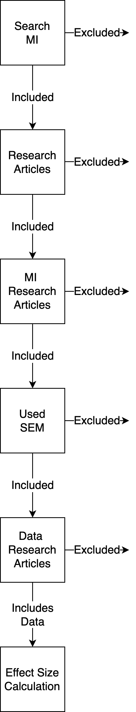

```{r setup, include = FALSE}
# libraries
library("papaja")
library(dplyr)
library(visualizemi)
library(rio)
library(knitr)
library(ggplot2)
library(tidyr)
library(lavaan)
# references
r_refs("references.bib")
```

```{r trackdown, eval = F}
source("../../../../files/google_creds.R")
# initial set up 
# upload_file(file = "rr_manuscript.Rmd",
#             gpath = "Assessment of Assessment",
#             gfile = "rr_manuscript_trackdown")
# from google 
download_file(file = "rr_manuscript.Rmd",
            gpath = "Assessment of Assessment",
            gfile = "rr_manuscript_trackdown")
# to google
update_file(file = "PG_Manuscript_2023.Rmd",
            gfile = "grade_lean_trackdown"
            rich_text = TRUE,
            hide_code = TRUE)
```

```{r analysis-preferences}
# Seed for random number generation
set.seed(3894389)
knitr::opts_chunk$set(cache.extra = knitr::rand_seed)
```

Psychological research involves the difficult task of assessing non-observable phenomena, such as depression or meaning in life, as a measurement proxy for testing hypotheses. Researchers develop surveys or instruments to estimate underlying constructs of interest [@devellis2022], with item relationships often validated with latent variable modeling (i.e., structural equation modeling [SEM]) or item response theory [IRT, @byrne2001]. Entire journals, such as *Assessment,* are devoted to the publication of scale development and (re)-assessment across populations - a necessary avenue given that development information for many scales is not reported in other journal articles [@barry2014; @weidman2017]. Scale development manuscripts are crucial to interpretation of studies that use these measures and determining the usefulness of measured scores [@flake2020].

Confirmatory factor analysis (CFA) is a common analysis that examines the relationship between observed variables and latent constructions, helping determine the overall model fit to the data collected [@kline2015]. Researchers specify the measurement model that demonstrates the proposed relation between measured items and latent variables and use fit indices such as the Tucker Lewis Index [TLI, @tucker1973], Comparative Fit Index [CFI, @bentler1990], Root Mean Square Error of Approximation [RMSEA, @steiger1990], and standardized root mean residual [SRMR, @bentler1995] to determine model fit. Generalized measures are designed, in theory, to provide the same assessment for different populations, but researchers can extend their investigation of item and latent variable properties by examining scale functioning across groups or subpopulations within the data. Multigroup CFA [MGCFA, @meredith1993] examines different components of a CFA model for measurement invariance. Measurement invariance (or equivalence) implies that the instrument provides the same latent variable measurement for all populations. Equivalence in measurement is desirable, as it allows for the same interpretation of latent variable scores across groups, as well as knowing that group differences are not attributable to differences the way the measure operates within groups.

Measurement invariance is tested by sequentially examining models with group equality constraints. There are several versions of the procedure, but the terminology and steps from @brown2005 are commonly found within studies on psychological constructs. First, groups are combined together within a *configural* model to assess for the same factor structure across groups. The factor loadings for each group are then set to be equal for the assessment of *metric* invariance, implying that each group has the same strength of item relation to the latent variable. *Scalar* invariance is this examined by constraining the item intercepts across groups, which implies that each group shows the same item means. Last, *strict* invariance may be tested by constraining the item residuals to be equal across groups, suggesting that each group shows the same variance across items. Each step is compared to the previous step to determine if the equality constraints result in a degradation of fit, often by using $\Delta$ CFI or $\Delta$ RMSEA [@cheung2002]. Scales that demonstrate measurement invariance allow researchers to use scores to make group comparisons without adjustments for measurement differences [@millsap2011].

Non-invariance implies that individuals in separate populations interpret items differently [@liu2017; @cheung2000; @wicherts2005; @dong2020], which may affect the overall latent variable score. Thus, it can be difficult to know if group differences are due to population differences or measurement. Being unaware of non-invariance in measures could lead to incorrect interpretations of group differences [@vandeschoot2015], and these results could potentially explain the replication or lack-thereof for results across studies [@maassen2023]. For example, @trent2013 examined the Revised Child Anxiety and Depression Scale [RCADS, @chorpita2000], an instrument that examines depression and anxiety disorders in children. They determined that the six-factor structure was appropriate for White and Black youth (*configural*) and that the factor loadings were also equal across groups (*metric*). They found that children differed in their item intercepts (*scalar*) for five items across the scale, which suggested that the same latent construct would represent different scale scores on those items. These results often suggest partial invariance, wherein the scale often generalizes minus a few items [@cheung1999].

Partial invariance is critical for valid interpretations because without it, researchers risk conflating true group differences with artifacts of measurement bias. Failure to identify and address non-invariance can lead to inaccurate conclusions about group-level comparisons and potentially undermine the validity of psychological research. Despite its importance, researchers frequently overlook measurement invariance testing, as highlighted by @maassen2023. Their study examined the reporting of measurement invariance tests across *Judgment and Decision Making*, *PLoS One*, and *Psychological Science* and found that 1) very few papers included measurement invariance tests; 2) none of those reported tests could be reproduced; and 3) very little measurement invariance was found across when new tests could be examined.

This study demonstrates the need for an investigation of measurement invariance within a journal that specifically targets assessments as the area of publication, such as *Assessment*. Given differences in cultural, experience, language skills, and more, we may not expect all measurements to show invariance across populations. Partial invariance extends multigroup testing of measurement invariance to show exactly where and how many parameters are non-invariant [@byrne1989; @meredith1993]. Understanding these items can lead to further investigation into group differences, new interpretation guidelines, or scale improvement to eliminate identified differences. Measurement invariance testing suffers from the same black-and-white judgment criteria found in traditional null hypothesis testing and *p*-values with cutoff criteria and rules of thumb [@marsh2004; @putnick2016]. $d_{MACS}$ was developed as an effect size for measurement invariance for group differences in observed variables, which is affected by both factor loadings and item intercepts [@nye2011].

`visualizemi` is a new *R* package that calculates the replication rate of the overall model steps in measurement invariance (as compared to randomized data), as well as the effect sizes for individual parameters, separating loadings, intercepts, residuals, and so on [@buchanan2024]. This package can be used to determine the overall model level replication effect sizes, individual parameter replication effect sizes, and effect sizes for non-invariance for each parameter separately (i.e., traditional Cohen’s $d_s$ based on parameter size differences). The replication effect sizes are calculated by creating bootstrapped samples from the data and comparing their model results to the same data with randomized group labels. The implication is that randomizing group labels should not affect the results if groups were truly equal in their measurement. The effect size is calculated as a version of Cohen’s $h$ which is the standardized difference in proportions between the bootstrapped results and randomized results. As the effect size increases, we would expect to find non-invariance between groups in a new sample, as the bootstrapped data shows consistent differences between groups.

At the moment, it is difficult to know what effect sizes one may expect to find for measurement invariance and what may be a level of measurement invariance to worry about (i.e., moving away black and white decision making on invariance). Researchers may be able to define a smallest effect size of interest in measurement invariance given the new publications on effect sizes within this area [@anvari2021; @lakens2018]. In this registered report, we propose to examine studies published within *Assessment* that report measurement invariance. We will create a database of studies that report measurement invariance and code these articles for the type of groups tested, steps of measurement invariance performed, and results obtained. This searchable database can be useful for further meta-research on measurement invariance or simple search for individuals searching for measurement instruments. Next, we will reproduce measurement invariance tests for publications with sufficient data and calculate the effect sizes for model and parameter level invariance. This information will be provided in the database to allow researchers to gauge what they may expect if they use a questionnaire or wish to replicate/extend previous work. We will provide the overall summary of effect sizes within measurement invariance tests and comment on the distributions of effect sizes found within the literature. We will end by providing researchers with suggestions for ways to determine their smallest effect size of interest for pre-registration or practical assessment.

# Proposed Method

## Database Curation

```{r figure-process, fig.cap="A flow chart of potential exclusions to create the database of measurement invariance."}

```

Using *Assessment*'s online search feature, we will search for **measurement invariance** allowing for either term to be present in the manuscript for inclusion in the first round of papers (which would also cover related terms such as **measurement equivalence**). As of December 2024, this search returns over 600 articles from 1994 (i.e., the journal’s establishment date) to 2024 publications. The data will then be filtered to only include research articles under the article type filter present on the journal website. These citations will be exported to the Zotero group created for this project found at: <https://www.zotero.org/groups/5407184/measurement_invariance_assessment>. Figure \@ref(fig:figure-process) displays the filtering and coding process to create the measurement invariance database. We chose this journal primarily due to journal focus, and the number of available articles indicates a large sample size of articles to investigate measurement invariance.

### Screening procedure

**Inclusion**: Each article will be coded for inclusion in the measurement invariance database and for potential further analysis by filling out a coding survey created for this purpose. The coding scale is included in Appendix A. We created the original article inclusion form using students enrolled in a structural equation modeling course, and pilot tested several articles to determine the scope of the project (see results below). We then tested if ChatGPT could respond to the survey questions and answer these questions accurately if given a copy of the research article. ChatGPT 4.0 appears to be able to answer questions accurately, and therefore, we will use the 4.0 model (or higher depending on time of study) to initially code articles. The example prompt and output from ChatGPT for an article with multiple invariance tests is included in Appendix A. The survey includes items to determine if the article includes measurement invariance, how the measurement was analyzed (i.e., structural equation modeling, item response theory, or other), and if the study included participant data (i.e., no simulation studies). Only research articles that used structural equation modeling to examine measurement invariance on participant data will be included in the database.

Measurement Invariance Variables: The next portion of the coding survey includes information about the measurement invariance test(s) in the manuscript. Each measurement test will be coded separately. ChatGPT will include the name and citation of the scale assessed, what groups are compared in the measurement invariance test, and the steps performed in the measurement invariance assessment. Once these steps are selected, ChatGPT will order them based on the manuscript, list the type of invariance claimed, and list the fit index used for determination of invariance, along with the rule (i.e., CFI, $\Delta$CFI \> .01, RMSEA, $\Delta$RMSEA \> .015 [@cheung2002]). If the data appears to be included, links for the repository will be extracted.

```{r pilot-data}
DF <- import("../data/Article_Coding_Assessment_pilot.csv")
DF2 <- DF %>% 
  select(invariance_yes, cfa_irt, real_data) %>% 
  filter(!duplicated(DF %>% select(doi_link)))
yes_mi <- round(table(DF2$invariance_yes, useNA = "ifany") / nrow(DF2) * 100, 1)
yes_sem <- round(table(DF2$cfa_irt[DF2$cfa_irt != ""], useNA = "ifany") / sum(table(DF2$cfa_irt[DF2$cfa_irt != ""], useNA = "ifany") ) * 100, 1)
yes_data <- round(table(DF2$real_data[DF2$real_data != ""], useNA = "ifany") / sum(table(DF2$real_data[DF2$real_data != ""], useNA = "ifany") ) * 100, 1)
DF3 <- DF %>% 
  filter(scale_name != "")
yes_data2 <- round(table(DF3$data, useNA = "ifany") / nrow(DF3) * 100, 1)
est_sem <- round(600 * yes_sem["Structural Equation Modeling"] / 100, 0)
est_data <- round(est_sem * yes_data["Yes"] / 100, 0)
est_data2 <- round(est_data * yes_data2["Yes"] / 100, 0)
```

### Coders

Coders will be recruited from author networks targeting researchers with self-identified experience in structural equation modeling. We will randomly select 10% of the articles processed by ChatGPT to check for accuracy. The coder will be given the responses from ChatGPT. They will note any incorrect answers or potential issues with output. The lead team will analyze these results to determine if consistent issues with particular questions answered by ChatGPT can be found. If these results indicate consistent inappropriate answers (i.e., more than 30% of the item is flagged completely incorrect), the lead team and coders will recode that item for all papers. For answers that are flagged as 30% partially incorrect (i.e., half correct, misleading, or otherwise not quite right), we will tweak the ChatGPT prompt until coders agree the issue has been fixed. Each coder will be asked to complete at least ten articles for credit [i.e., the data curation CRediT category, @allen2014]. We will report these coding statistics for the randomly selected articles.

### Pilot Test

A pilot test of the coding procedure was completed with the lead author's structural equation modeling teaching course[\^This test was completed before ChatGPT tests but provides information about the number of expected articles and scope of the project]. Each coder was assigned a specific issue of Volume 30 of *Assessment*, and they examined all articles within that issue. Approximately `r yes_mi["Yes"]` percent of articles within those issues included measurement invariance (*n* = `r nrow(DF2)` unique articles coded). Of those articles, `r yes_sem["Structural Equation Modeling"]` % used structural equation modeling, and of those articles, `r yes_data["Yes"]` percent used participant data. `r nrow(DF3)` measurement invariance tests were coded, and approximately `r yes_data2["Yes"]` percent included data for testing.

For the proposed project, we might expect that a smaller proportion will be excluded for only discussing measurement invariance, as the coding class project examined all articles within an issue, rather than just examining results returned from the online search. If the other percentages are approximate, then we might expect that `r est_sem` articles would use structural equation modeling, `r est_data` would include participant data, and `r est_data2` may have available data for examination. Given the recent trends in transparency and openness, this number is likely an overestimate as the pilot included only new articles.

## Database Analysis

The final coding of articles and their measurement invariance tests will be presented as a database of measurement invariance results. These results can be re-used in other meta-analytic studies. We will present the following summary statistics:

-   Prevalence of Measurement Invariance
    -   Total number of articles published to date
    -   Total number of invariance related articles
    -   Split of articles into structural equation modeling, item response theory, and other analyses types
    -   Number of articles that analyzed participant data (versus simulation only studies)

We will incorporate this information in Figure \@ref(fig:figure-process) similar to a Prisma schema to show the number of articles included in each step of the screening procedure.

-   Measurement Invariance Test Statistics
  -   Commonly reported scales
  -   Frequency of number of groups compared
  -   Frequency of data inclusion for reproducibility

The statistics from this section will be calculated based on the number of papers coded.

  -   Commonly occurring group comparisons: we will code this variable into overall category labels. Variable group labels will be determined based on results from the study, but we expect certain categories such as age, gender/sex, language, country, and race/ethnicity. 
  -   Frequency of each type of measurement invariance assessment (i.e., number of equal form, equal item intercepts, etc.)
  -   Commonly used fit statistics and rules of thumb for invariance testing
  -   Frequency of each type of measurement invariance claimed

The statistics from this section will be calculated based on the total number of measurement invariance tests coded. If a paper includes multiple invariance tests, it will therefore be included multiple times in the overall assessment of measurement invariance claimed (for example).

## Effect Size Calculation

Each measurement invariance test that included data will then be coded using the template in Appendix 2. Using the `visualizemi` package [@buchanan2024], coders will program a multigroup confirmatory factor analysis using the steps outlined from the research article and the provided data. Each model will first be examined for convergence across the same measurement invariance steps from the published articles, only using information present within the article or supplemental material for factor structure and any modifications made to scale structure (i.e., correlated residuals). Models that do not converge will be noted, and no more analysis on that data will be performed. Each model will then be tested for replication effect sizes rates at the model and parameter level. For example, an article that claimed measurement invariance for equal form, loadings, and intercepts will be tested with these same steps to determine the effect size of potential replication for each of those steps.

The `visualizemi` package calculates the effect size of potential replication by bootstrapping the original data with replacement and compares these results to the same bootstrapped dataset that has had the group labels randomized. Table \@ref(tab:table-1-example) shows the results of model level bootstrapping using the Holzinger-Swineford data embedded in the *lavaan* package [CITE]. The factor loadings (*metric* invariance) were non-invariant when compared to a *configural* model 90% of the time while the randomized data was non-invariant only 10% of the time. The $h_{mni}$ effect size represents the standardized difference between these two proportions and the amount of expected non-invariance if the study was replicated with similar data. The range of $h$ statistics is $\pi$, so the $h_{mni_p}$ column represents the $h_{mni}$ scaled -1 to 1 for easier interpretation. At zero, we would expect to find that the bootstrapped data and randomized data do not show differences (thus, should be invariant), and as the $h_{mni_p}$ statistic approaches 1, the more likely we are to find non-invariance in new samples.

```{r example-vm-code, eval = F}
HS.model <- ' visual  =~ x1 + x2 + x3
              textual =~ x4 + x5 + x6
              speed   =~ x7 + x8 + x9 '

                    # cfa model
saved_mgcfa <- mgcfa(model = HS.model,
                     # dataset in data frame 
                     data = HolzingerSwineford1939, 
                     # grouping variable column 
                     group = "sex",
                     # lavaan syntax for group constraints
                     group.equal = c("loadings", "intercepts", "residuals"), 
                     # any other lavaan cfa arguments
                     meanstructure = TRUE)


saved_boot_model <- bootstrap_model(
  # saved configural model to start at
  saved_configural = saved_mgcfa$model_configural,
  # dataset for the analysis
  data = HolzingerSwineford1939,
  # model lavaan syntax
  model = HS.model,
  # group variable in the dataset
  group = "sex", 
  # number of bootstraps
  # this is set to a low number to compile quickly for cran
  nboot = 1000,
  # name of the fit measure you want to use, make sure it's lavaan
  invariance_index = "cfi",
  # rule for the difference in fit indices
  invariance_rule = .01,
  # what order of steps do you want to test? 
  group.equal = c("loadings", "intercepts", "residuals")
)

save(saved_boot_model, file = "../data/saved_boot_example.Rdata")

saved_boot_partial <- bootstrap_partial(
  # the model you want to test 
  # use the model before your invariant one
  # in this case it broke down at loadings
  saved_model = saved_mgcfa$model_configural,
  # the dataframe
  data = HolzingerSwineford1939,
  # the original model syntax
  model = HS.model,
  # the grouping variable column
  group = "sex",
  # run more but start low for testing
  nboot = 1000,
  # what index are you using for invariance?
  # match this to lavaan's name under fitmeasures()
  invariance_index = "cfi",
  # what rule are you using?
  invariance_rule = .01,
  # what are we comparing against? 
  invariance_compare = unname(fitmeasures(saved_mgcfa$model_configural, "cfi")),
  # which step you want to estimate effect size for
  partial_step = c("loadings"), 
  # which parameters you want to hold constrained
  group.equal = c("loadings")
  )

save(saved_boot_partial, file = "../data/saved_boot_partial_example.Rdata")
```

```{r table-1-example,  results = 'asis'}
load("../data/saved_boot_example.Rdata")
apa_table(
  saved_boot_model,
  note = "",
  caption = ""
)
```

If a model showed any partial invariance, we will then use the partial bootstrapping function in `visualizemi` to calculate the effect size of replicating partial invariance and the difference between parameter estimates. Given the HolzingerSwineford1939 data shown in Table \@ref(tab:table-1-example), we would examine the results of partial invariance at the loadings step to determine where the potential group differences lie. Each factor loading would be individually relaxed one at a time and the bootstrapping procedure is examined for each loading separately. Table \@ref(tab:table-2-example) demonstrates the results of the bootstrapping for the HolzingerSwineford1939 data, including the number of non-invariant results for each individual factor loading. We will report $h_{mni_p}$ for each parameter, along with $d_s$ for the group size differences between groups for bootstrapped estimates. The effect size difference between parameter estimates is calculated by using $d_s$ for independent samples groups. These estimates are calculated on the standardized loadings so they are comparable across different scale examples.

```{r table-2-example, results = 'asis'}
load("../data/saved_boot_partial_example.Rdata")
apa_table(
  saved_boot_partial$boot_DF,
  note = "",
  caption = ""
)
```

Each measurement invariance comparison found in the database curation (with data) will be programmed by one coder and checked by another coder using a small number of bootstrap simulations. If a disagreement arises during the code checking process, which cannot be resolved by the coders, the lead author will make the final decision. After both coders and the lead author (if applicable) agree that the coding matches the article data, the model and parameter level simulations will be run over 1000 simulations on a high performance computing server to ensure consistency in versions of *R* and packages. The exact versions will be reported for reproducibility. The results will be exported in both an HTML format and Rdata for further use. These files will be available on our repository at <https://github.com/doomlab/assessment-squared>.

### Model Level Results

We will compile the results based on measurement invariance steps (i.e., configural, metric, scalar, etc.), and we will report the following (simulated data below):

-   Mean, standard deviation, sample size for each measurement invariance step
-   25, 50, 75% quantile values
-   Visualization of the distribution of effects - for example, Figure \@ref(fig:figure-violin)

These results are based on the total number of programmed measurement invariance analyses, as not all articles from the database curation are expected to include data.

```{r figure-violin, fig.cap="A visualization of the effect sizes for measurement invariance at the model level."}
Intercepts <- rnorm(n = 100, mean = -.2, sd = .10)
Loadings <- rnorm(n = 100, mean = -.4, sd = .30)
Residuals <- rnorm(n = 100, mean = -.12, sd = .15)
DF_model <- data.frame(Intercepts, Loadings, Residuals) %>% 
  pivot_longer(cols = everything(), 
               names_to = "step", 
               values_to = "h")
ggplot(DF_model, aes(step, h)) + 
  theme_classic() + 
  geom_violin() + 
  geom_boxplot(width = .2) + 
  xlab("Measurement Invariance Step") + 
  ylab("h Measurement Invariance")
```

### Parameter Level Results

For the parameter level results, the bootstrapping function returns similar information for each of the parameters in the final step of the model as described above. We will present:

-   Mean, standard deviation, sample size for each type of parameter (loadings, intercepts, residuals, etc.)
-   25, 50, 75% quantile values
-   Visualization of the distribution of effects

Next, the function additionally returns effect sizes for group differences on each parameter, $d_s$. This value is calculated as the average mean difference of the parameter estimates for each group divided by their pooled standard error across bootstraps. $d_s$ is calculated for both the bootstrapped data and the randomized data. We will calculate a "normalized" effect size for each parameter by subtracting $d_s$ for the bootstrapped data minus the $d_s$ for the randomized data. Because group order is arbitrary in our analysis, we will take the absolute value of the effect size for final reporting. From this dataset, we will report:

-   Mean, standard deviation, sample size for each type of parameter (loadings, intercepts, residuals, etc.)
-   25, 50, 75% quantile values
-   Visualization of the distribution of effects

## Results Interpretation

Our study is exploratory to determine the landscape of measurement invariance effect size using the premier journal outlet in clinical psychology for such publications. We make no predictions on the direction or size of the results. Instead, we will present the database for future reuse and examine the results for any consistent patterns or findings. By understanding the range of published values[^1], researchers can use these results to gauge their study results against. We will comment on potential ideas for estimating the smallest effect of interest for measurement invariance.

[^1]: The advantage of studying measurement invariance in this scenario is that both invariant and non-invariant models are typically publishable. While publication bias likely still exists, it may be less than traditional effect size meta-analysis studies.

\newpage

# References

::: {#refs custom-style="Bibliography"}
:::

\newpage

# (APPENDIX) Appendix {.unnumbered}

```{r child = "appendix_1.Rmd"}
```

```{r child = "appendix_2.Rmd"}
```
